# 📱 Quotely

**Quotely** is a modern Flutter application for discovering, saving, and organizing inspirational quotes with a smooth and engaging user experience.

---

## 📸 App Preview

### 🔐 Authentication & Onboarding
| Login | Signup | Reset Password |
| :---: | :---: | :---: |
| 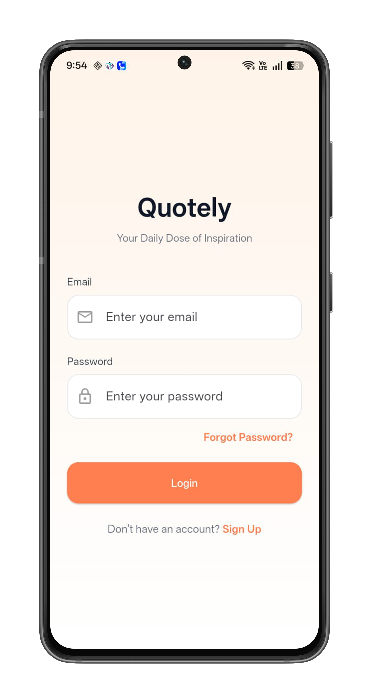 | 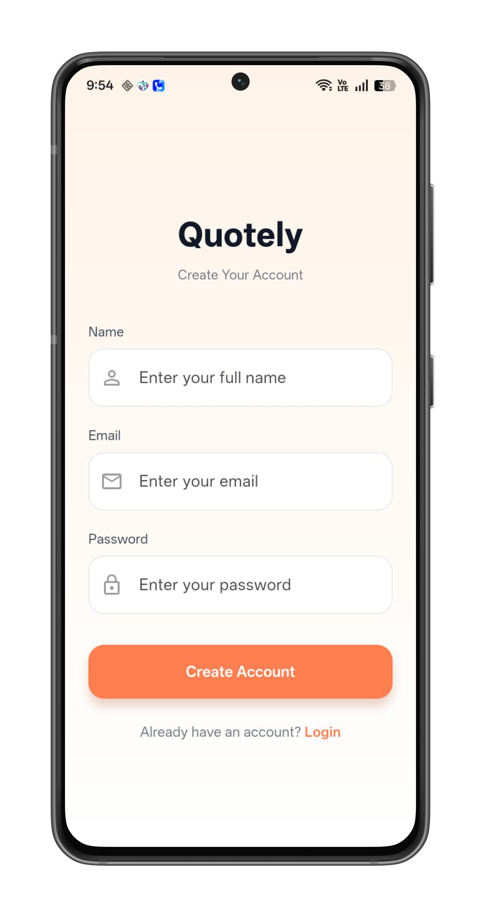 | 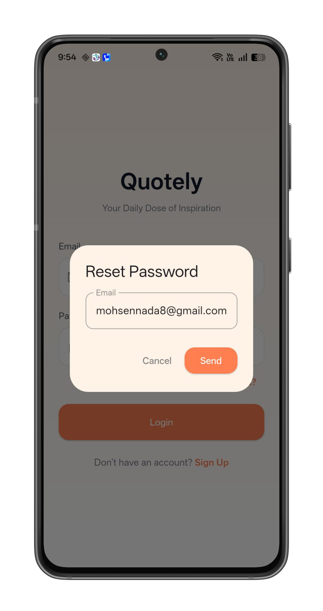 |

### 🏠 Core Experience
| Home Feed | Search & Filter | Share Quote |
| :---: | :---: | :---: |
| 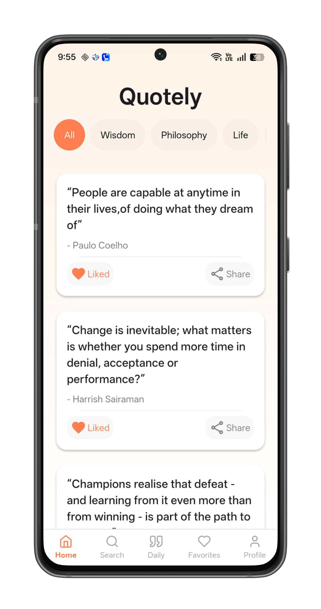 | 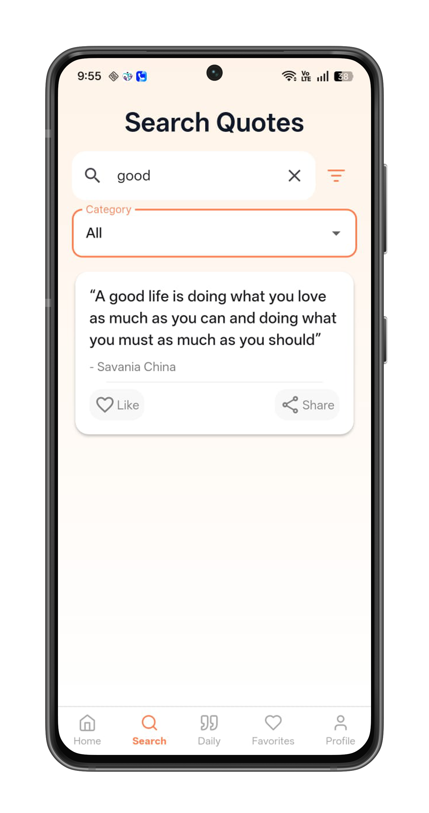 | 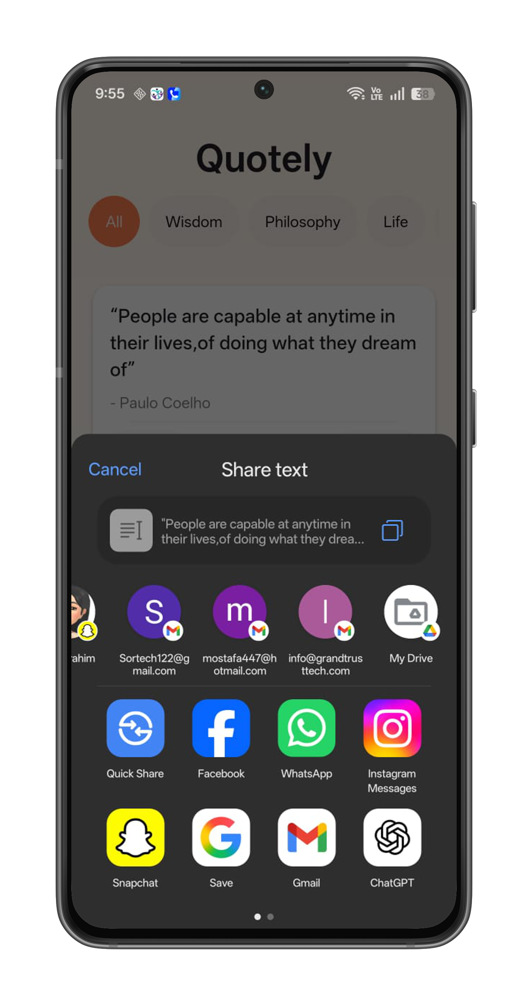 |

### 📂 Favorites & Collections
| Favorite | Add to Collection | My Collections |
| :---: | :---: | :---: |
| 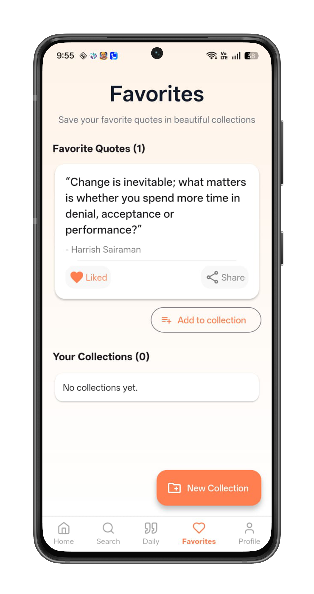 | 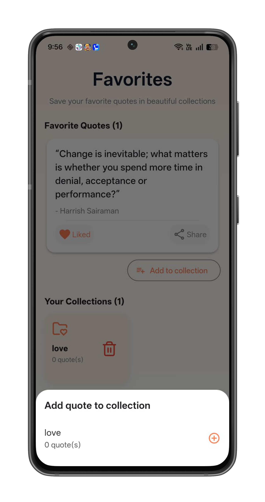 | 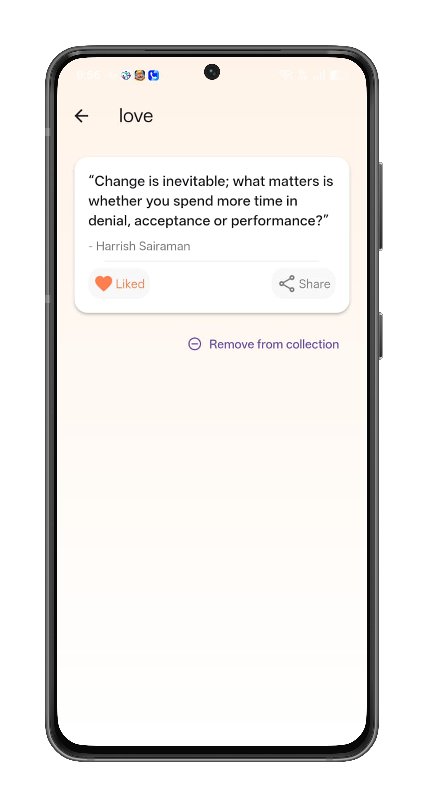 |

### 📅 Daily Inspiration & Profile
| Daily Quote | Android Home Widget | Profile |
| :---: | :---: | :---: |
| 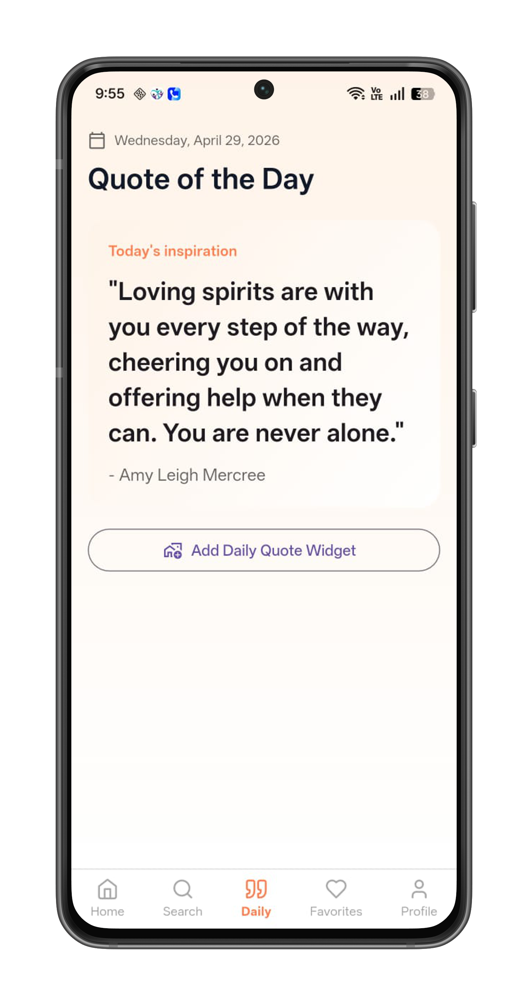 | 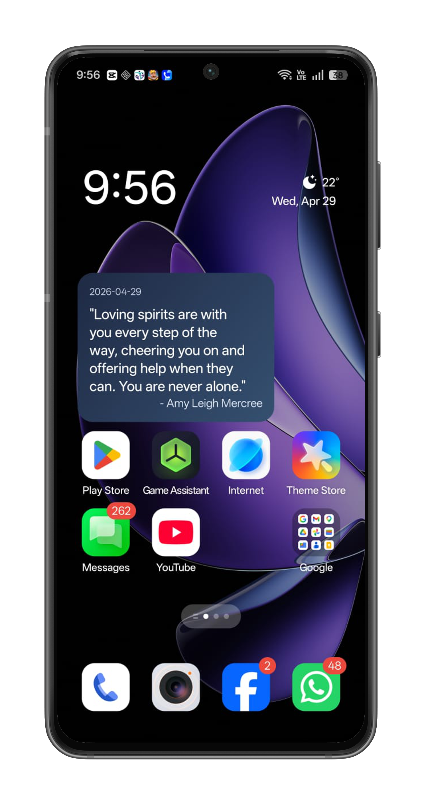 | 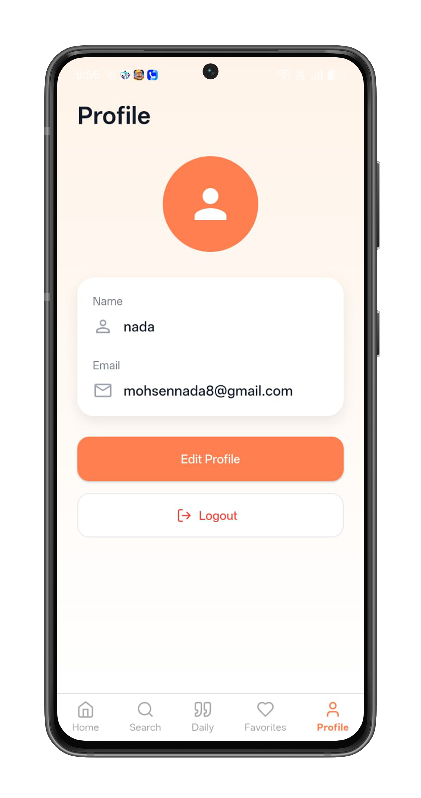 |

---

## ✨ Key Features

**🔒 Secure Authentication**: Full authentication flow using Firebase Auth (Login, Signup, Password Reset)[cite: 113].
* **🔍 Smart Discovery**: Explore quotes by category or search by author/text with real-time filtering[cite: 111, 112].
* **📂 Organized Collections**: Create custom collections and manage favorite quotes in folders synced with Cloud Firestore[cite: 113].
* **📅 Daily Inspiration**: Dedicated screen for the "Quote of the Day" with local caching for offline access[cite: 108].
* **🖼 Android Home Widget**: Stay inspired with a native Android widget that syncs with the app via Method Channels.
* **📤 Easy Sharing**: Share your favorite quotes directly through the system's native share sheet.

---

## 🏗 Architecture & Tech Stack

The project follows **Feature-first Clean Architecture** principles to ensure the code is scalable, testable, and maintainable.

### Technical Stack:
* **Framework**: [Flutter](https://flutter.dev) (Dart)[cite: 103].
* **State Management**: [Flutter BLoC / Cubit](https://pub.dev/packages/flutter_bloc) for predictable state transitions[cite: 106].
* **Backend**: Firebase (Auth, Firestore, FCM)[cite: 113].
* **Networking**: [Dio](https://pub.dev/packages/dio) for REST API consumption (API Ninjas)[cite: 111].
* **Local Storage**: [SharedPreferences](https://pub.dev/packages/shared_preferences) for caching and [SQLite](https://pub.dev/packages/sqflite) for structured data[cite: 108].
* **Communication**: Method Channels for Flutter-to-Native (Android Widget) communication.

### Folder Structure:
```text
lib/
 ├── core/          # Reusable widgets, themes, and data sources
 └── features/      # Feature-based folders (auth, home, search, etc.)
      ├── data/     # Models & Repositories
      ├── logic/    # Cubits/State Management
      └── presentation/ # UI Screens & Widgets
```
## ⚙️ Setup & Installation

1.  **Clone the repository**:
    ```bash
    git clone [https://github.com/Nada8324/Quotely.git](https://github.com/Nada8324/Quotely.git)
    ```
2.  **Install dependencies**:
    ```bash
    flutter pub get
    ```
3.  **Environment Variables**:
    * Create a `.env` file in the root directory.
    * Add your API key: `QUOTES_API_KEY=YOUR_KEY_HERE`.
4.  **Firebase Setup**:
    * Add your `google-services.json` to `android/app/`.
    * Run `flutterfire configure` if you are using a new project.
5.  **Run the app**:
    ```bash
    flutter run
    ```

---

## 🛠 Future Enhancements
- [ ] Add Repository pattern for better abstraction.
- [ ] Implement Unit & Widget testing for core features.
- [ ] Add CI/CD pipeline using GitHub Actions.

---

## 📄 License
This project is part of my graduation work at **NTI (National Telecommunication Institute)**.

**Developed by [Nada Mohsen](https://github.com/Nada8324)** 🚀
